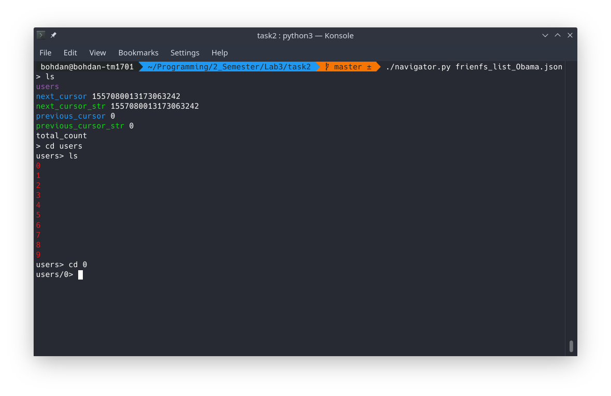

# JSON Navigator


## Description
Python script for navigating through JSON files.

## Usage
To start the application
```bash
python navigator.py <filename>
```
or
```bash
./navigator.py <filename>
```

Commands:
- ```ls```  — show current directory (can also use ```dir```)
- ```cd <dict or list>``` — move to dictionary or list
- ```cd /path/to/dict_or_list``` — go to dictionary or list using absolute path
- ```cd ..``` — go back
- ```cd``` — go back to the start
- ```quit``` — leave the program (can also use ```exit```)

## Result

